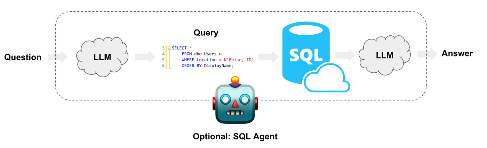

# Chatbot SQL en Python avec GPT-4 et Mistral AI

Ce projet vise le développement d'un chatbot capable d'interpréter les requêtes en langage naturel, de générer des requêtes SQL et de récupérer les résultats d'une base de données SQL, le tout de manière intuitive et conviviale. Il utilise la puissance du modèle GPT-4 d'OpenAI, intégré avec une interface utilisateur Streamlit pour une expérience d'interaction améliorée.

## Fonctionnalités
- **Traitement du langage naturel** : Utilise GPT-4 pour interpréter et répondre aux requêtes des utilisateurs en langage naturel.
- **Génération de requêtes SQL** : Génère dynamiquement des requêtes SQL basées sur l'entrée en langage naturel de l'utilisateur.
- **Interaction avec la base de données** : Se connecte à une base de données SQL pour récupérer les résultats des requêtes, démontrant une interaction pratique avec la base de données.
- **Interface utilisateur Streamlit** : Dispose d'une interface conviviale construite avec Streamlit, facile à utiliser pour les utilisateurs de tous niveaux.
- **Basé sur Python** : Entièrement codé en Python, mettant en avant les meilleures pratiques de développement logiciel avec les technologies modernes.

## Explication brève du fonctionnement du chatbot

Le chatbot fonctionne en prenant une requête en langage naturel de l'utilisateur, en la convertissant en une requête SQL à l'aide de GPT-4, en exécutant la requête sur une base de données SQL, puis en présentant les résultats à l'utilisateur en langage naturel. Ce processus implique plusieurs étapes de traitement des données et d'interaction avec l'API OpenAI et une base de données SQL, le tout intégré de manière transparente dans une application Streamlit.

Considérez le diagramme suivant pour comprendre comment les différents maillons et composants sont construits :




## Installation
Assurez-vous d'avoir Python installé sur votre machine. Ensuite, clonez ce dépôt :

```bash
git clone [lien-du-dépôt]
cd [répertoire-du-dépôt]
```

Installez les paquets requis :

```bash
pip install -r requirements.txt
```

Créez votre propre fichier .env avec les variables nécessaires, incluant votre clé API OpenAI :

```bash
OPENAI_API_KEY=[votre-clé-api-openai]
```

## Utilisation
Pour lancer l'application Streamlit et interagir avec le chatbot :

```bash
streamlit run app.py
```